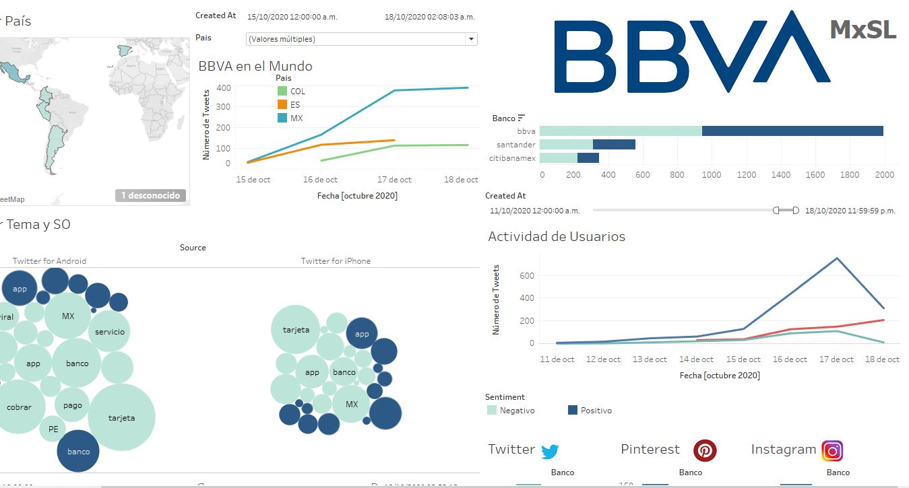

# Hackathon_BBVA_2020
Final Result of the proyect Hackathon BBVA 2020 solving the Social Listening Challenge

## Social Listening
Authors:

Cardoso Olvera Edgar David

Perrilliat García Ian

Garcés Mondragón Eduardo Arturo

Gómez Herrera María Andrea Liliana

## Dashboard:
https://public.tableau.com/profile/edco17#!/vizhome/Compiladores_Hachathon2020_MxSL/Dashboard1?publish=yes

## Compiladores de Ciencia MxSL Tool Hackathon 2020 video:
https://www.youtube.com/watch?v=xXX6kMknGOE&feature=youtu.be

BBVA.xlsx is the main database with information from twitter.

Redes.xlsx is the secondary database for various social network.

Data_Frame.py allows you to obtain and update the previous databases.

NPL_DeepLearning_Model.ipnyb is the RNN model used for the clasification of tweets.

Pinterest_Scrapping.ipynb is the way to scrap Pinterest.

Twitter_Analayisis.ipynb is a exploratory analysis of the database used for the dashboard.

